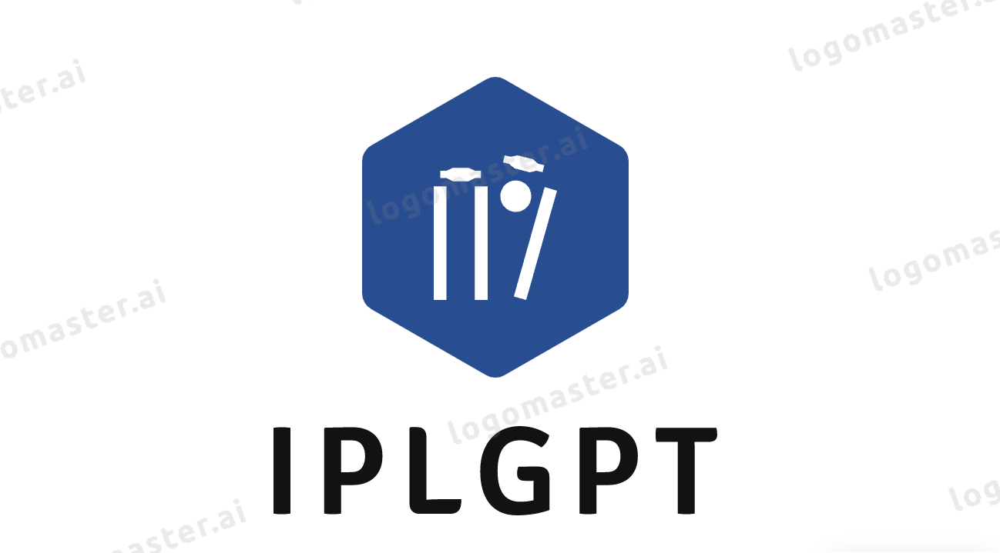

<div align="center">



______________________________________________________________________

<p align="center">
  <a href="#running-the-app">Getting Started</a> •
  <a href="ipl.gpt">IPL GPT App URL</a>
</p>

______________________________________________________________________

</div>

# iplGPT

With iplGPT, you can ask questions about the Indian Premier League (IPL).

## Running the app

Create a virtual environment and install the dependencies.

```bash
python3 -m venv venv
source venv/bin/activate

pip install -e .
```

Populate the database with the data.

```bash
python3 populate.py
```

Run the app.

```bash
streamlit run app.py
```

```

## What is iplGPT?

\[TODO\]

## Structure

\[TODO\]
```
